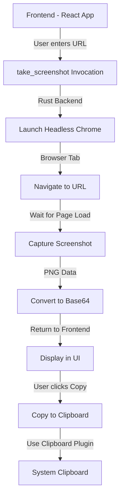

# Tauri Site Screenshot

A desktop application that captures screenshots of websites using Tauri, headless Chrome, and TypeScript.

## Overview

Tauri Site Screenshot is a cross-platform desktop application that allows users to take high-quality screenshots of any website by simply entering a URL. The app leverages Tauri's ability to combine web technologies with native capabilities, using headless Chrome on the backend to render websites and capture screenshots.

## How It Works

### Frontend (TypeScript/React)

The frontend is a simple React application that provides:

- A form to input the website URL
- UI to display the captured screenshot
- Error handling and loading states
- A button to copy the screenshot to clipboard

### Backend (Rust)

The Rust backend handles the heavy lifting:

1. Launches a headless Chrome browser using the `headless_chrome` crate
2. Navigates to the specified URL
3. Waits for the page to fully load
4. Captures a screenshot as PNG data
5. Encodes the screenshot as a base64 data URL
6. Returns the result to the frontend

### Key Components

#### Rust Commands

- `take_screenshot(url: String)`: Invoked from the frontend to capture a website screenshot
- Uses the `headless_chrome` crate to control Chrome/Chromium browser

#### TypeScript Utilities

- `copyImage()`: Utility to copy image data to the system clipboard using Tauri's clipboard plugin

## Technical Details

### Screenshot Capture Flow

1. The user enters a URL in the input field and submits the form
2. The frontend invokes the `take_screenshot` command with the URL
3. The Rust backend:
   - Launches a headless Chrome instance
   - Creates a new tab and navigates to the URL
   - Waits for the page to fully load
   - Captures a PNG screenshot
   - Converts the PNG data to a base64-encoded data URL
   - Returns the result to the frontend
4. The frontend displays the screenshot and enables the copy functionality

### Clipboard Integration

When the user clicks the "Copy" button:

1. The base64 image data is fetched and converted to a blob
2. The blob is converted to an array buffer
3. The array buffer is passed to the `copyImage` utility
4. The Tauri clipboard plugin writes the image data to the system clipboard

## Dependencies

### Rust Dependencies

- `tauri`: Core framework for building desktop apps
- `headless_chrome`: Library for controlling Chrome/Chromium browsers
- `base64`: For encoding/decoding base64 data
- `tauri-plugin-clipboard-manager`: For clipboard operations
- `tauri-plugin-opener`: For opening external resources

### TypeScript Dependencies

- `@tauri-apps/api`: For invoking Rust commands
- `@tauri-apps/plugin-clipboard-manager`: For clipboard operations
- React for the UI

## Implementation Notes

- The screenshot is taken with a 90% quality setting in PNG format
- Error handling is implemented at multiple levels for robustness
- The UI shows loading indicators during screenshot capture and copying
- The app uses base64 encoding to transfer image data between Rust and TypeScript

## Limitations

- Mobile platforms (Android/iOS) do not support the clipboard image functionality
- Requires Chrome or Chromium to be installed on the system
- Some websites may block headless browsers or require authentication

## Getting Started

1. Ensure you have Rust and Node.js installed
2. Clone the repository
3. Install dependencies: `npm install`
4. Run the development server: `npm run tauri dev`
5. Build for production: `npm run tauri build`

## License

[MIT License](LICENSE)
